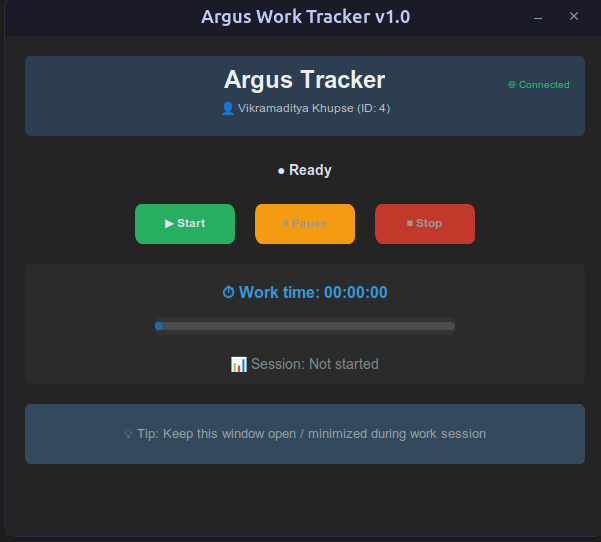
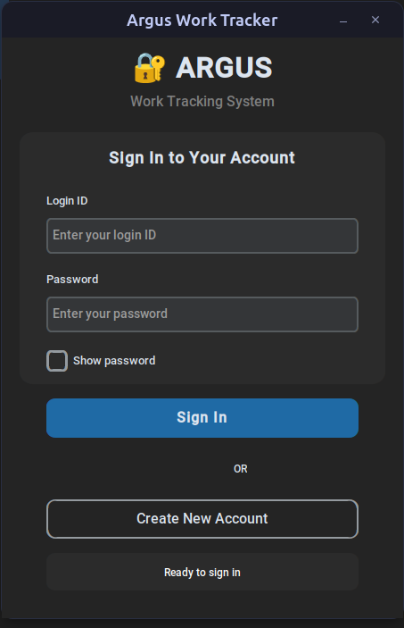
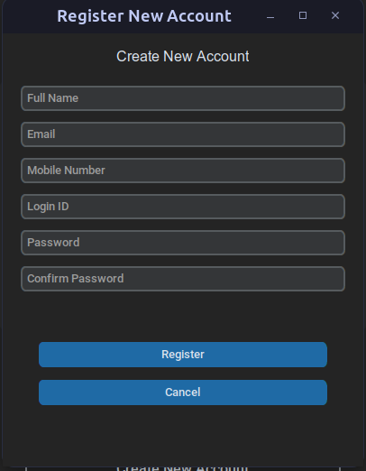

# Argus - Automated Productivity Tracker


Argus is a cross-platform desktop application that automatically tracks work activity through periodic screenshots and activity monitoring, helping users analyze their productivity patterns.

  
*Main Application Window - [More Screenshots](#screenshots)*

## Features

- 🖥️ **Automatic Screenshot Capture**
  - Configurable time intervals (2-4 minutes)
  - Multi-monitor support
  - Smart activity detection

- ⏱️ **Accurate Time Tracking**
  - Real-time work hour calculation
  - Pause/resume functionality
  - Inactivity detection

- 🔐 **Secure Authentication**
  - Login/Registration system
  - API integration
  - User-specific data storage

- 📊 **Productivity Insights**
  - Screenshot timeline
  - Activity heatmaps (coming soon)
  - Weekly reports (coming soon)

## Installation

### Prerequisites
- Python 3.8+
- pip

### Method 1: From Source
```bash
git clone https://github.com/Phantom-VK/Argus.git
cd Argus
pip install -r requirements.txt

# Run application
python src/argus/main.py
```

### Method 2: Download Executable
Download the latest release for your platform:

[](https://github.com/Phantom-VK/Argus/releases)
[](https://github.com/Phantom-VK/Argus/releases)
[](https://github.com/Phantom-VK/Argus/releases)

## Usage

1. **Authenticate** with your credentials
2. **Start Tracking** when beginning work
3. **View Reports** in the dashboard (coming soon)
4. **Export Data** via the API integration

## Screenshots

| Login Window | Registration | Main Interface |
|--------------|-------------|----------------|
|  |  |  |

## Technology Stack

- **Frontend**: 
  
- **Backend**: 
  
- **Packaging**: 
  
- **Dependencies**:
  
  

## Development

### Build Instructions
```bash
# Windows
scripts/build_win.bat

# macOS
chmod +x scripts/build_mac.sh
./scripts/build_mac.sh

# Linux
chmod +x scripts/build_linux.sh
./scripts/build_linux.sh
```

### Project Structure
```
Argus/
├── src/              # Source code
│   ├── argus/        # Core application
├── scripts/          # Build scripts
├── docs/             # Documentation
└── requirements.txt  # Dependencies
```

## Contributing

Contributions are welcome! Please open an issue or submit a PR.

## License

MIT License - See [LICENSE](LICENSE) for details.

